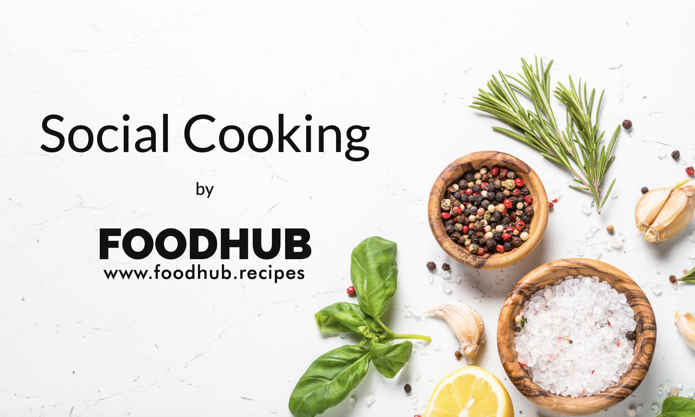
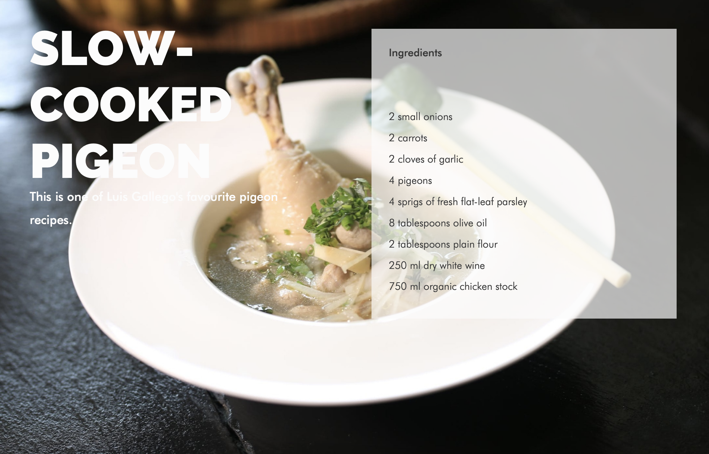
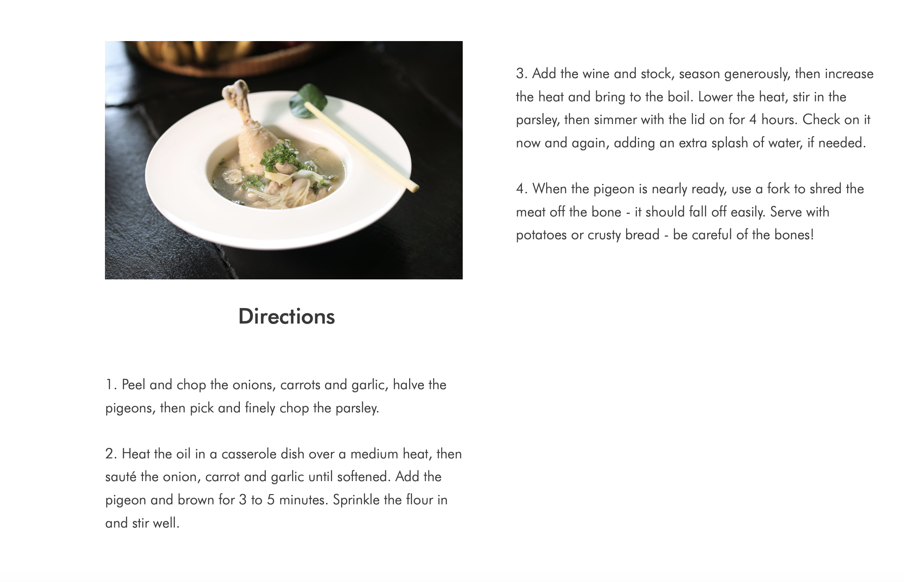
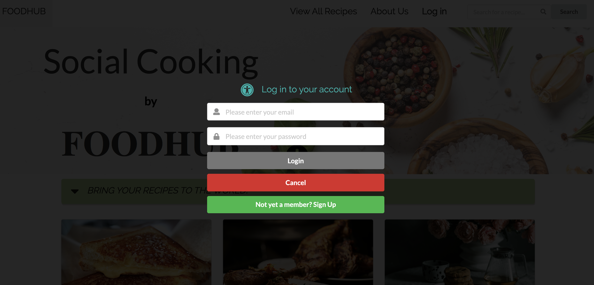
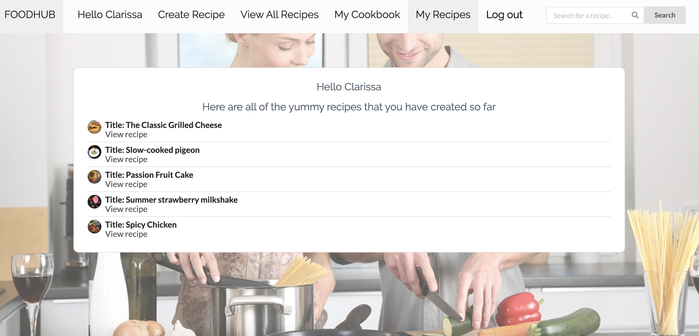
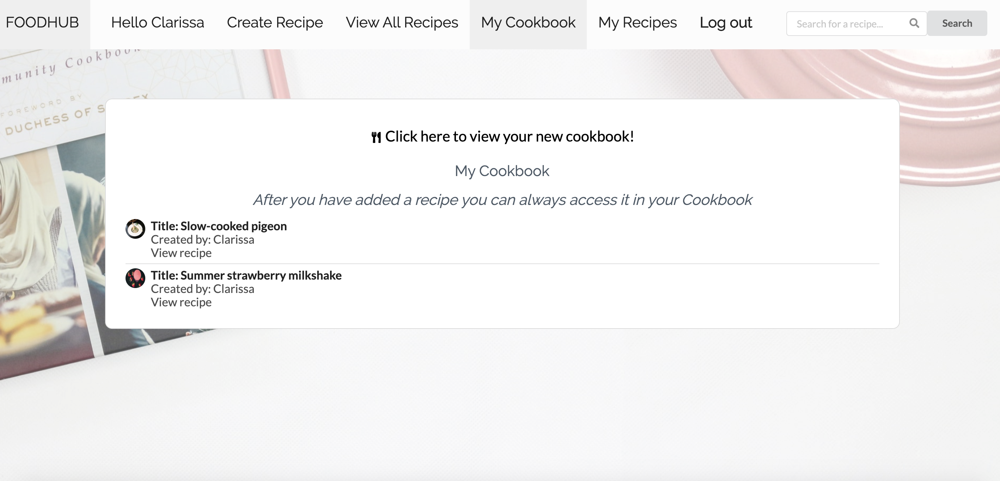

## FoodHub - The Final Project with CraftAcademy

The application was created in November 2019, as a final project during the last 2 weeks of the Craft Academy [Full Stack Web Developer Bootcamp](https://craftacademy.se/english/). 

---
### Authors
[Clarissa Liljander](https://github.com/clalil)  
[Sverrir Steindorsson](https://github.com/shsteindorsson)  
[Yasmine Ezequiel](https://github.com/yasmineezequiel)  
[Becca Burns]()  
[Miyesier Kaerman]()  

## Built with  
Back-end API:
- [Ruby on Rails](https://rubyonrails.org/), version 6.0.1  
- [RSpec](https://rspec.info/), for unit testing  
- [Swagger](https://swagger.io/), for documenting our API as well as for unit testing  

Front-end Client:
- [React](https://rspec.info/), version 16.11.0
- [Cypress](https://www.cypress.io/), for automated testing
- [Enzyme](https://airbnb.io/enzyme/), for component testing
- [Amazon webstorage](https://aws.amazon.com/), for storing user generated images 
- [Semantic UI React](https://react.semantic-ui.com/) and CSS, for UX 

### Dependencies  
Back-end API:
* [Elastic search](https://github.com/elastic/elasticsearch-ruby/tree/master/elasticsearch-extensions)
* [Chewy](https://github.com/toptal/chewy)
* [Prawn](https://github.com/prawnpdf/prawn)
* [Pundit](https://github.com/varvet/pundit)
* [AWS](https://rubygems.org/gems/aws-sdk-s3/versions/1.0.0.rc2)  
...please see our Gemfile to view all of our dependencies in this project. 

Front-end Client:
* React
* Axios
* Redux & Redux Token Auth  
...please see our package.json file to view all of our dependencies in this project.  

---
## Deloyment URL
This application consists of a front-end Client and a back-end API. Our team's CraftAcademy repos are found at:  
[Front-end Deployment](https://foodhub.recipes/) and [Front-end GitHub](https://github.com/CraftAcademy/foodhub-client)  
[Back-end Deployment](https://.herokuapp.com/) and [Back-end GitHub](https://github.com/CraftAcademy/foodhub-api)

---
## User Stories & Project Management
Our team worked agile over the two week timeline using 7 day sprints beginning with a two-day design sprint. For more information, please read our user stories and our features on our [Pivotal Tracker board](https://www.pivotaltracker.com/n/projects/2417177). 

---
## Getting Started
If you want to try out the code for yourself on your local machine:  
### API
Fork the FOODHUB API repo, clone it down.  
Run the following command to to install all of the dependencies above and some additional ones on your computer:
>$ bundle   

Then run this command to create a database and populate it with users and recipes:  
>$ rails db:create db:migrate db:seed
  
To run the application locally on your computer:
>$ rails s  

To run the unit tests:
>$ rspec

Please note that you need to have elastic search installed locally on your computer beforehand in order for the unit tests to pass on the server side of our application. 

### Client
Fork the FOODHUB Client repo, clone it down.  
This command will install all of the dependencies on your computer: 
>$ yarn install

To run the application locally on your computer:
>$ yarn start

To run all of our feature tests:
>$ yarn cy:open

---
## Test Coverage and Continuous Integration (CI)
[Coveralls](https://coveralls.io/) was used to test our code coverage for the API during this project.  
[Istanbul](https://istanbul.js.org/) was used to test our code's Cypress test coverage for the Client side of the project.  
Continuous integration was handled using [Semaphore](https://semaphoreci.com/).  

---
## Acknowledgements
- [StackOverflow](https://stackoverflow.com/)
- [Image sources](https://stock.adobe.com/)
- [Pexels](https://www.pexels.com/)

---
## Special Thanks
To our coaches and staff at [Craft Academy](https://craftacademy.se/)!

## License
This project is under the [MIT](https://opensource.org/licenses/MIT)-license